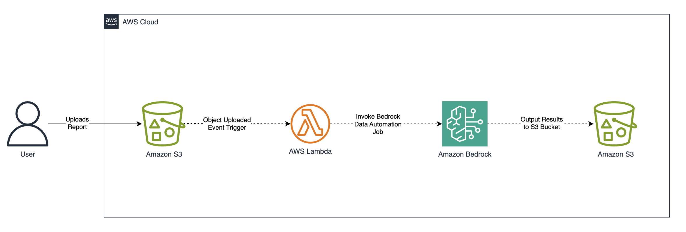

# Oil & Gas Well Report Data Extraction with Amazon Bedrock Data Automation

## The Problem: Fragmented Legacy Well Data

Oil and gas operators accumulate decades of well documentation — permits, completion reports, petrophysical logs, directional surveys, frac reports, and regulatory filings. This data lives in:

- Scanned paper records and PDFs with inconsistent layouts
- Operator-specific formats (each company structures reports differently)
- Mixed-content documents combining text, tables, wellbore diagrams, and engineering schematics
- Legacy systems like Wellview, OpenWells, and state databases (e.g., Louisiana SONRIS)

The result: critical engineering data is locked in unstructured documents, making cross-well analysis, regulatory compliance, and asset evaluation manual and error-prone.

## What This Project Does

This proof of concept demonstrates using **Amazon Bedrock Data Automation (BDA)** to extract **structured data** from heterogeneous well reports and normalize it into a unified, queryable format.

Specifically, BDA processes PDF well reports and returns structured fields including:

| Data Category | Extracted Fields |
|---|---|
| Well Identification | API number, well name, operator, field, county/parish, state, spud date, measured depth, product type |
| Perforation Data | Top/bottom perforation depths per stage |
| Completion Summary | Stage lengths, proppant volumes, water volumes |
| Casing Records | Casing size, weight, depth |
| Water Sources | Source name, supply type, volume used, location coordinates |

The output is structured JSON that can be loaded directly into DataFrames, databases, or analytics pipelines.

## Why BDA — Not Just OCR or Text Extraction

Standard text extraction (Textract, Tesseract, etc.) gives you raw text. BDA provides **domain-aware structured extraction** through custom blueprints:

| Capability | Generic OCR/Extraction | BDA with Custom Blueprints |
|---|---|---|
| Raw text from PDFs | ✓ | ✓ |
| Table detection | Partial | ✓ (structure-aware) |
| Domain-specific field mapping | ✗ | ✓ (blueprint-defined) |
| Cross-format normalization | ✗ | ✓ (same schema, different layouts) |
| Mixed content (diagrams + tables + text) | ✗ | ✓ |
| Operator-specific extraction logic | ✗ | ✓ (per-operator blueprints) |

### Custom Blueprints Are the Differentiator

This project includes two operator-specific blueprints (`operator1_engineering_blueprint.json` and `operator2_engineering_blueprint.json`) that demonstrate:

1. **Same output schema, different source layouts** — Both operators produce completion reports, but with different page structures, table formats, and terminology. The blueprints handle this variation while producing a normalized output.

2. **Targeted extraction instructions** — Each field includes explicit instructions telling BDA where to find data (e.g., "Extract the proppant volume pumped from the stimulation table only on the wellbore diagram page").

3. **Industry-specific data types** — The blueprints understand oil & gas concepts: perforation intervals, frac stages, casing strings, API numbers, and water source tracking for regulatory compliance.

## Project Structure

```
23-Energy-Well-Reports/
├── app.py                                    # Streamlit UI application
├── requirements.txt                          # Python dependencies
├── 23-Energy_Well_Reports.ipynb              # Interactive walkthrough notebook
├── data/
│   ├── blueprints/                           # Custom extraction blueprints
│   │   ├── operator1_engineering_blueprint.json
│   │   ├── operator2_engineering_blueprint.json
│   │   ├── solar_inspection_blueprint.json
│   │   └── wind_turbine_maintenance_blueprint.json
│   └── reports/                              # Sample well reports (PDF)
│       ├── operator1_report.pdf
│       └── operator2_report.pdf
├── source/                                   # Helper utility functions
│   ├── bda.py                                # BDA API wrapper (create blueprints, projects, run jobs)
│   ├── batch_processor.py                    # Parallel batch processing for scale
│   ├── blueprint_analyzer.py                 # Blueprint comparison and differentiation analysis
│   ├── consolidate.py                        # Cross-operator data normalization
│   ├── insights.py                           # Business insights from extracted data
│   ├── logger.py                             # Logging configuration
│   └── utils.py                              # AWS and data processing utilities
└── README.md
```

## Scale Considerations

### What Has Been Tested

- Individual well completion reports (typically 10–50 pages per document)
- Two distinct operator report formats with different layouts
- Extraction of structured fields from mixed-content pages (text + tables + diagrams)

### BDA Service Limits

| Parameter | Limit |
|---|---|
| Maximum file size | 500 MB per document |
| Maximum pages | 3,000 pages per document |
| Supported formats | PDF, images (JPEG, PNG, TIFF) |
| Concurrent jobs | Account-level quotas apply (check AWS Service Quotas) |
| Processing timeout | Configurable; default 600s in this project |

### Production Considerations

- **Batch processing**: For large-scale digitization (thousands of well files), implement job queuing with SQS or Step Functions. The `start_processing_job` function supports async invocation for this purpose.
- **Large documents**: BDA supports documents up to 3,000 pages. For legacy well files that exceed this (e.g., bound field books), pre-split documents before processing.
- **Throughput**: Request quota increases via AWS Service Quotas for high-volume workloads. BDA processes documents asynchronously, so parallelism is achievable.
- **Cost**: BDA pricing is per-page. Budget accordingly for large-scale digitization projects.

> **Note**: This proof of concept has not been validated at production scale (>1,000 documents or >1,000 pages per document). Scale testing is recommended before production deployment.

## What's Next: Downstream Use Cases

Extracted structured data enables analytics that aren't possible with unstructured documents:

| Use Case | Description |
|---|---|
| **Cross-well comparison** | Compare completion designs, proppant loading, and water usage across wells in a field |
| **Regulatory compliance** | Automated verification of water source reporting, casing integrity records, and permit compliance |
| **Asset evaluation** | Rapid data room population for M&A due diligence — normalize decades of well files into queryable datasets |
| **Trend analysis** | Track changes in completion practices over time (stage counts, proppant volumes, lateral lengths) |
| **Anomaly detection** | Flag wells with unusual completion parameters or missing required data fields |
| **Type curve development** | Feed normalized completion and production data into decline curve analysis |

### Integration Patterns

#### Architecture



```
Well Reports (PDF) → BDA Extraction → Structured JSON → 
    ├── Data Lake (S3 + Athena) for ad-hoc queries
    ├── Data Warehouse (Redshift) for cross-well analytics
    ├── Knowledge Base (Bedrock) for natural language Q&A
    └── Dashboard (QuickSight) for field-level KPIs
```

## Applicability Beyond Oil & Gas

While this demo focuses on oil & gas well reports, the pattern — **custom blueprints for domain-specific document extraction** — applies across energy and utilities:

| Sub-Vertical | Document Types | Extractable Data |
|---|---|---|
| **Solar** | Inspection reports, interconnection agreements | Panel degradation rates, inverter specs, grid capacity |
| **Wind** | Turbine maintenance logs, SCADA exports | Component failure history, downtime events, power curves |
| **Utilities** | Compliance filings, outage reports, rate cases | Reliability metrics, financial impact, customer impact |
| **Geothermal** | Well logs, reservoir assessments | Temperature gradients, flow rates, formation data |
| **Pipeline** | Integrity assessments, ILI reports | Anomaly locations, wall thickness, corrosion rates |

The key requirement is defining a blueprint schema that maps to your document structure.

## Getting Started

### Prerequisites

- AWS account with Amazon Bedrock Data Automation access enabled
- Python 3.9+ environment
- S3 bucket for document storage and processing output (see [SECURITY.md](SECURITY.md))

### Installation

```bash
pip install boto3>=1.38.27 pandas>=2.3.1 streamlit>=1.58.0
```

Or using the requirements file:

```bash
pip install -r requirements.txt
```

> **Note (macOS with Homebrew Python):** If you get an "externally-managed-environment" error, create a virtual environment first:
> ```bash
> python3 -m venv .venv
> source .venv/bin/activate
> pip install -r requirements.txt
> ```

### Option A: Running the Streamlit UI (Recommended for Demos)

The project includes a Streamlit web application (`app.py`) that provides a visual interface for the entire extraction workflow — no Jupyter notebook required.

#### Prerequisites

1. **AWS credentials configured** on your machine:
   ```bash
   aws configure
   ```
   This sets up your Access Key ID, Secret Access Key, and default region.

2. **An existing S3 bucket** in your AWS account for document storage and output. BDA writes extraction results here.

3. **Amazon Bedrock Data Automation enabled** in your AWS region (default: `us-east-1`).

4. **IAM permissions** for your user/role:
   - `bedrock:*` (or scoped Bedrock Data Automation permissions)
   - `s3:PutObject`, `s3:GetObject`, `s3:ListBucket` on your bucket
   - `sts:GetCallerIdentity`

#### Running the UI

```bash
streamlit run app.py
```

This opens a browser at `http://localhost:8501` with four tabs:

| Tab | What It Does |
|---|---|
| **Upload Reports** | Drag-and-drop PDF well reports, uploads them to your S3 bucket |
| **Blueprints & Project** | Register custom extraction blueprints in BDA and create a processing project |
| **Run Extraction** | Select uploaded files, submit BDA extraction jobs, monitor progress |
| **View Results** | Display extracted structured data — summaries, tables, per-page content |

#### UI Workflow

1. **Sidebar** → Enter your AWS Region, Profile (optional), and S3 Bucket Name → Click **Connect to AWS**
2. **Upload Reports** tab → Upload PDF files (or verify existing files in S3)
3. **Blueprints & Project** tab → Click **Register Blueprints in BDA** → Click **Create / Find Project**
4. **Run Extraction** tab → Select files → Click **Start Extraction** (takes 1–3 minutes per file)
5. **View Results** tab → See extracted data: summary, description, full markdown content, per-page breakdown

#### How the UI Works (Technical Overview)

The app is a single Python file (`app.py`, ~250 lines) built with [Streamlit](https://streamlit.io). It wraps the existing `source/bda.py` and `source/utils.py` functions with a visual interface:

```
Browser ←→ Streamlit Server (app.py) ←→ AWS (Bedrock, S3, STS)
                    ↓
         source/bda.py (create blueprints, run jobs)
         source/utils.py (S3 uploads, downloads, data conversion)
```

- **No separate backend needed** — Streamlit runs Python server-side and renders the UI
- **State management** — Uses `st.session_state` to persist AWS session, project ARN, and results across interactions
- **Re-run model** — Streamlit re-executes the script on every user interaction; session state preserves data between reruns

### Option B: Running the Jupyter Notebook

1. Clone this repository
2. Configure AWS credentials (`aws configure` or environment variables)
3. Open `23-Energy_Well_Reports.ipynb`
4. Follow the step-by-step walkthrough to:
   - Create custom blueprints from the provided schemas
   - Set up a BDA project with those blueprints
   - Process sample well reports
   - View extracted structured data as DataFrames

## Security

Before running this project, review **[SECURITY.md](SECURITY.md)** for guidance on:
- Configuring least-privilege IAM policies for Bedrock, S3, and STS
- Securing the S3 bucket (encryption, public-access blocking, TLS-only policies)

This code does **not** create IAM policies or S3 buckets — that is the user's responsibility.

## Changes and Fixes

The following issues were identified via manual review and automated scanning and have been resolved:

### Code Fixes (source/bda.py)

| Issue | Severity | Fix |
|---|---|---|
| Infinite polling loop with no timeout | High | Added `max_wait_seconds` (default 600s) and `poll_interval` (default 10s) parameters. Raises `TimeoutError` when exceeded. |
| No handling of failed/error job status | High | Added check for terminal failure states (`ServiceError`, `ClientError`). Raises `RuntimeError` on failure. |
| `create_custom_blueprint` swallows errors | Medium | `ClientError` is now re-raised after logging. `ConflictException` handled gracefully. |
| `create_bda_project` ignores session parameter | Medium | Fixed to use `session.client()` instead of `boto3.client()`. |
| `open()` missing explicit encoding | Low | Added `encoding="utf-8"` to file open call. |
| Unnecessary `else` after `return` | Low | Removed redundant `else` block. |

### Documentation Additions

| Issue | Fix |
|---|---|
| No IAM policy guidance | Created `SECURITY.md` with minimum required IAM permissions. |
| No S3 bucket security guidance | Added S3 hardening section to `SECURITY.md`. |
| Prerequisites lack setup links | Added links to Bedrock Getting Started guide and BDA IAM role docs. |
| SONRIS reference unexplained | Expanded SONRIS description with full context. |
| Emojis as section markers | Removed emojis from notebook headers for accessibility. |

## Contributors

- [Pavan Pusuluri](https://www.linkedin.com/in/pavan-pusuluri-03871021)
- [Avneet Bansal](https://www.linkedin.com/in/avneet-bansal-4402231b)
- [Swetha Tharvesanchi Mallikarjuna](https://www.linkedin.com/in/swetha-tharvesanchi-mallikarjuna-b65a4091/)
- [Jin Fei](https://www.linkedin.com/in/jin-fei-64926a7)
- [Sachin Khanna](https://in.linkedin.com/in/sachinkhanna43)
- [Colin Sturm](https://www.linkedin.com/in/colinsturm)
