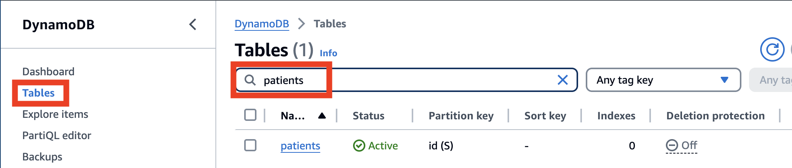
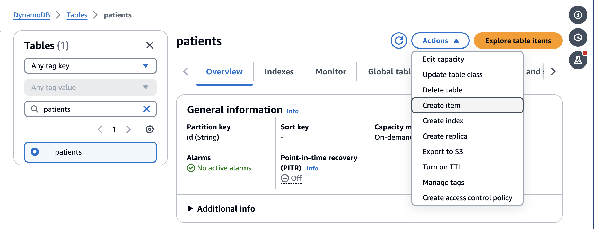
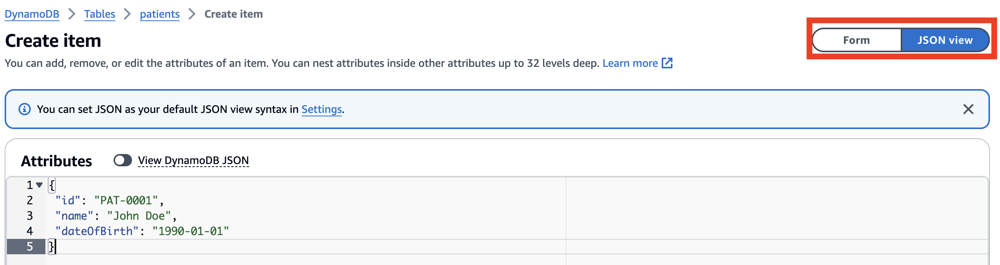
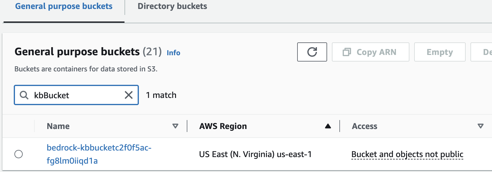
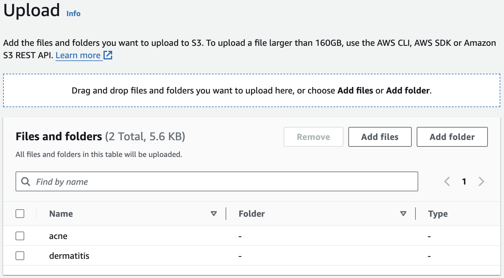
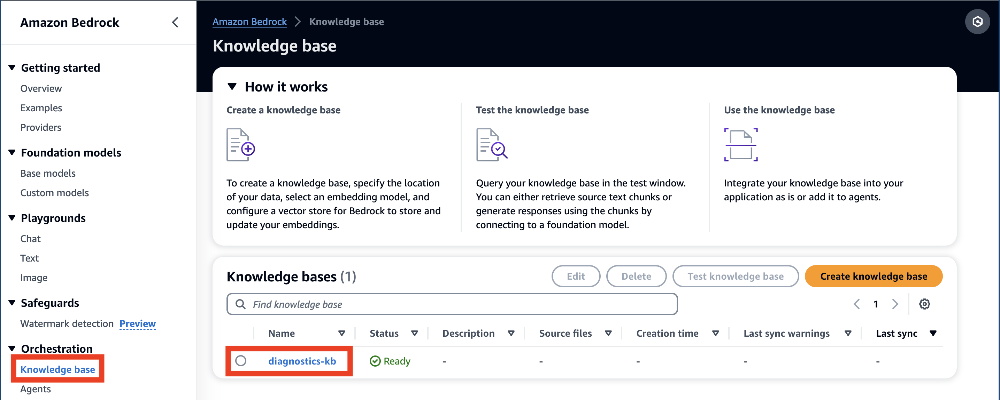
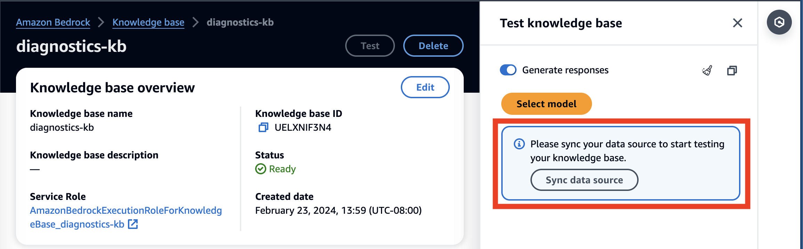
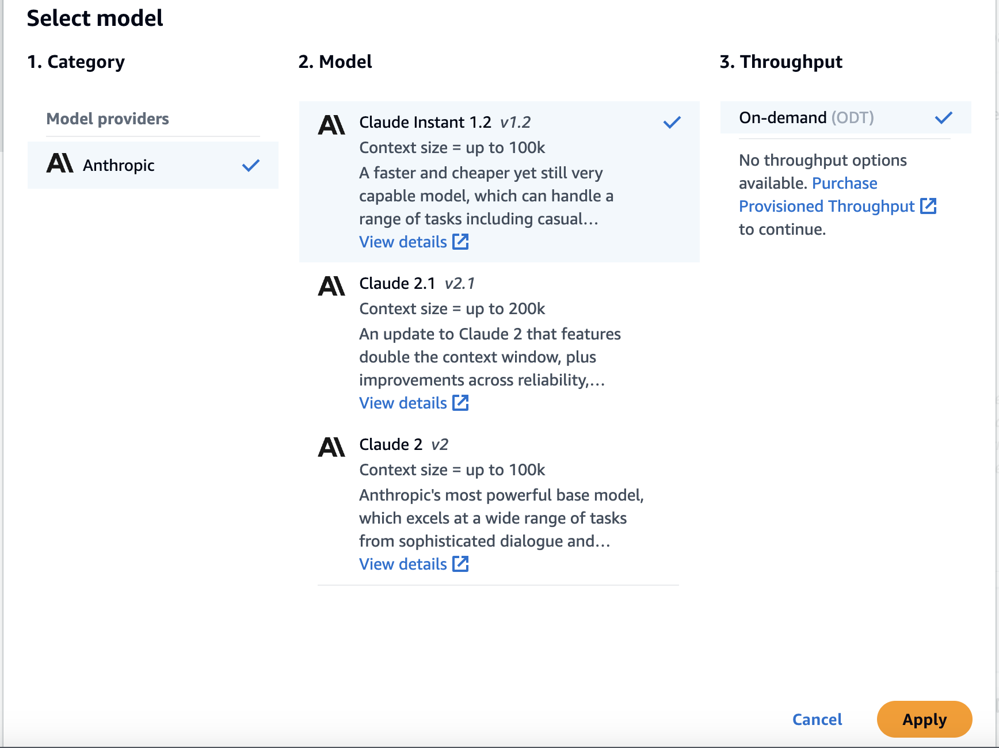

# Automate Discharge Instructions
=================================

## Authors:
- [Rafael Caixeta](https://www.linkedin.com/in/rafaelcaixeta/) @caixeta
- [Vamsi Pitta](https://www.linkedin.com/in/vamsipitta/) @vvpitta
- [Armando Diaz](https://www.linkedin.com/in/armando-diaz-47a498113/) @armdiazg 
- [Marco Punio](https://www.linkedin.com/in/marcpunio/) @puniomp

This guide details how to install, configure, and use an [Agent for Amazon Bedrock](https://aws.amazon.com/bedrock/agents/) that will use an example patient API and an example [Knowledge Bases for Amazon Bedrock](https://aws.amazon.com/bedrock/knowledge-bases/) to take in promps like `generate discharge instructions for [patient-id] and [diagnostic]` and consult both the example API and Knowledge Base to generate discharge instructions based on a provided template.

Example prompt and response is available in details on instructions below.


# Prerequisites
===============

* [node](https://nodejs.org/en) >= 16.0.0
* [npm](https://www.npmjs.com/) >= 8.0.0
* [AWS CLI](https://aws.amazon.com/cli/) >= 2.0.0
* [AWS CDK](https://docs.aws.amazon.com/cdk/api/v2/docs/aws-construct-library.html) >= 2.127.0
* [Docker](https://www.docker.com/):
   - Install [Docker](https://docs.docker.com/desktop/) or
   - Create an [AWS Cloud9](https://docs.aws.amazon.com/cloud9/latest/user-guide/create-environment-main.html) environment

*Note: In some cases, you might need to authenticate Docker to Amazon ECR registry with get-login-password. Run the aws ecr [get-login-password](https://docs.aws.amazon.com/AmazonECR/latest/userguide/getting-started-cli.html) command. `aws ecr get-login-password --region region | docker login --username AWS --password-stdin aws_account_id.dkr.ecr.region.amazonaws.com`*

## Setup AWS Infratructure

1. Install NPM Packages

    ```bash
    npm i
    ```

2. Generate the template

    ```bash
    cdk synth -q
    ```

3. Bootstrap your AWS Account for CDK (*This only needs to be done once for a AWS Account. If you already bootstrap your AWS Account for CDK you can skip this step.*)

    ```bash
    cdk bootstrap
    ```

4. Deploy to your AWS Account in context (*Make sure you correctly configure AWS CLI and have a profile and region set*)

    ```bash
    cdk deploy roles
    cdk deploy opensearch
    cdk deploy api-spec
    ```
5. Copy *'apiSpecBucketName'* value from *Outputs* and run the below command after updating *{BUCKET_NAME}*

    ```bash
    aws s3 cp api-spec/schema.json s3://{BUCKET_NAME}
    cdk deploy bedrock
    ```
## Create Sample Patient Data

1. Open [Amazon DynamoDB](https://us-east-1.console.aws.amazon.com/dynamodbv2/home) and search for '*patients*' table.

    

2. Click *Actions->Create item*

    

3. Switch to JSON view and paste the following sample record

    ```json
    {
    "id": "PAT-0001",
    "name": "John Doe",
    "dateOfBirth": "1990-01-01"
    }
    ```

    

## Testing Amazon Bedrock Knowledge Base

1. Open [Amazon S3](https://s3.console.aws.amazon.com/s3/buckets) and search for '*kbBucket*'

    

2. Click bucket named '*bedrock-kbbucketXXXXXXXXX*' and upload your actual documents. For this demo, you can upload files from /sampledocs folder.

    

3. Open [Amazon Bedrock](https://us-east-1.console.aws.amazon.com/bedrock/home) and click from Knowledge Base from the navigation.

    

4. Click on '*Sync data source*'

    

5. Wait for sync to finish and click '*Select Model*' and select '*Claude Instant 1.2*' Model.
    

6. Paste the sample prompt provided below and click '*Run*'

    ```
    Write a discharge report for the patient PAT-0001 and diagnostic 'acne'.

    Utilize the following template to write this report, make sure you add all the information required and don't leave any {} tags:

    Discharge Summary

    Patient Name: {patient name}
    Date of Birth: {patient date of birth}
    Primary Diagnostic: {diagnostic name}

    {diagnostic details}

    {diagnostic medicines}

    {diagnostic care}

    {diagnostic more}
    ```

    Model response

    ```
    Discharge Summary
    
    Patient Name: <name on database>
    Date of Birth: <date of birth on database>
    Primary Diagnostic: Acne
    
    Acne is a medical condition that occurs when pores on the surface of the skin become plugged. A pore is an opening of a hair follicle (root) and an oil gland. Pores get blocked when the glands make too much oil. Dirt collects, which causes bacteria to grow in the glands. The skin swells and forms painful bumps, commonly called pimples.[1]
    
    Topical medicine: These medicines include gels, ointments, creams, pastes, or liquid solutions that are put on your skin. They help decrease swelling and skin shedding. Hormone medicine: These medicines help control the production of oil from the oil glands. Birth control pills are an example of hormone medicine. Acne medicine: These are vitamin-based medicines, which are most useful in treating severe acne. These medicines may have serious side effects. You must not get pregnant or breastfeed while you are using this medicine. Steroids: This medicine may be given to decrease inflammation.[2]
    
    Be gentle when you wash: Do not rub or scrub your skin with a washcloth. Do not use hot water. Gently pat your skin dry with a clean towel or cloth. Be careful with the medicines you are taking: Certain medicines, including natural and herbal medicines, may trigger an acne flare-up. Always check for skin changes when you take your medicines. Ask your primary healthcare provider before you use herbal medicines or products to control acne. Do not squeeze, pop, or pick your pimples: This may damage your skin and cause infection or scarring. Protect your skin from the sun: Wear sunscreen that has a sun protectant factor (SPF) approved by your primary healthcare provider. Follow the directions on the label when you use sunscreen. Use water-based, oil-free makeup, soaps, or skin cleansers: Oil-based makeup may make acne worse. Check product labels on water-based makeup, since even these may have some added oil.[3]
    
    Contact your primary healthcare provider dermatologist if:
     - Your acne is not getting better or gets worse after treatment.
     - You think you are pregnant and need to make sure it is safe to take your acne medicine.
     - You have questions about your condition or care.[4]
    ```

# How to delete

From within the root project folder (``automate-discharge-instructions``), run the following command:

```sh
cdk destroy --force --all
```

**Note - if you created any aliases/versions within your agent you would have to manually delete it in the console.**
